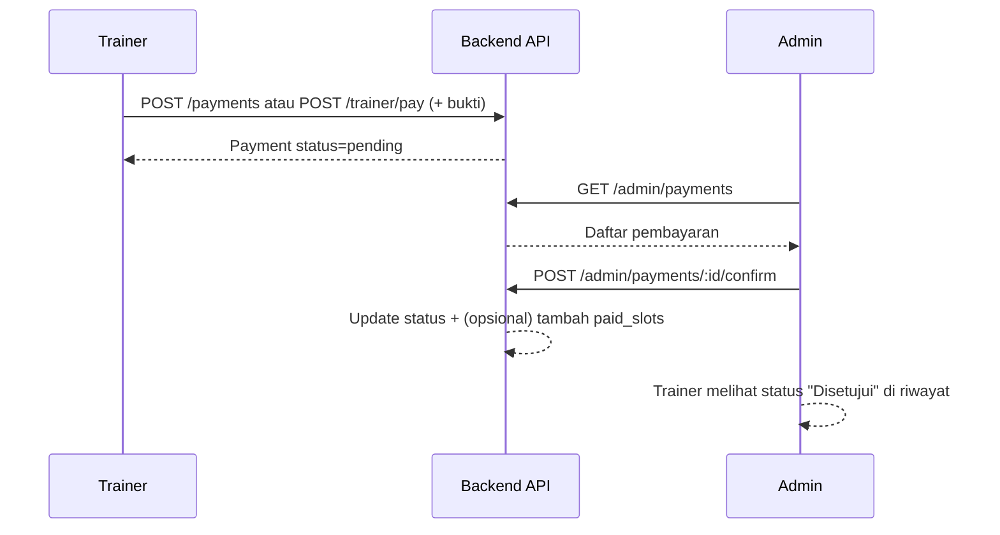
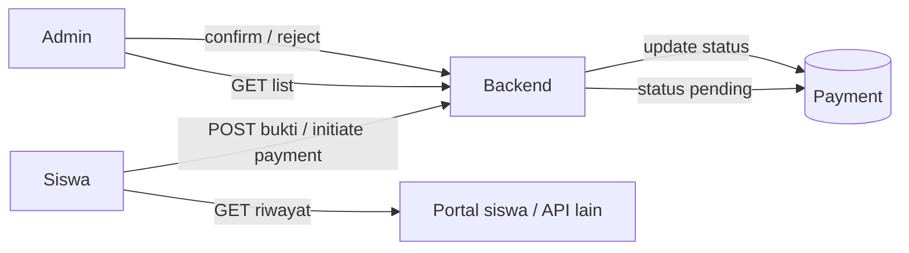

# Alur pembayaran & konfirmasi (siswa & trainer)

Dokumen ini menjelaskan **flow end-to-end** yang diharapkan antara frontend (FansEdu LMS), pengguna (**siswa** atau **trainer/guru**), dan **admin** yang memverifikasi pembayaran.  
Backend harus mengekspos endpoint yang konsisten; kontrak di bawah ini adalah **referensi implementasi** yang dipakai di `src/lib/api.ts`.

---

## Ringkasan peran

| Peran | Aksi di aplikasi web ini |
|--------|---------------------------|
| **Admin** | Melihat semua pembayaran, **menyetujui** atau **menolak** (`/admin/payment`). |
| **Trainer** | Melihat **riwayat pembayaran sendiri** (`/guru/pembayaran`); tidak mengonfirmasi. |
| **Siswa** | Tidak memakai web app ini saat ini; flow siswa di bawah untuk **API / integrasi lain** (mobile, portal siswa, dll.). |

---

## Model data pembayaran (konsep)

- Satu entitas **Payment** memiliki minimal: `id`, `user_id`, `amount` / `amount_cents`, `type`, `status`, `proof_url` (opsional), `created_at`.
- **Status** yang disarankan:
  - `pending` — menunggu verifikasi admin
  - `confirmed` / `completed` — disetujui
  - `rejected` — ditolak (opsional: `reason` / `notes`)

---

## Flow A: Pembayaran dari Trainer (slot peserta, dll.)

Trainer membayar atau mengunggah bukti (mis. transfer bank) untuk **slot pendaftaran peserta**.

**Setelah konfirmasi**, backend biasanya:

- Mengubah `status` payment menjadi `confirmed`
- Menambah **slot** trainer (`paid_slots`) jika transaksi ini untuk slot pembayaran

Frontend memanggil:

- `GET /trainer/payments` atau fallback `GET /payments` — riwayat trainer
- `POST /admin/payments/:id/confirm` — admin

---

## Flow B: Pembayaran dari Siswa (luar app admin/trainer)

Siswa biasanya memakai **saluran lain** (app siswa, web terpisah). Alur konsepnya sama:

**Catatan:** Endpoint siswa di codebase ini antara lain `GET /student/payments` (untuk integrasi jika token siswa). **Konfirmasi tetap oleh admin** melalui endpoint admin yang sama.

---

## Endpoint backend yang direkomendasikan

| Method | Path | Keterangan |
|--------|------|------------|
| `GET` | `/api/v1/admin/payments` | Daftar semua pembayaran untuk verifikasi |
| `POST` | `/api/v1/admin/payments/:id/confirm` | Setujui pembayaran |
| `POST` | `/api/v1/admin/payments/:id/reject` | Body opsional: `{ "reason": "..." }` |
| `GET` | `/api/v1/trainer/payments` | Riwayat trainer (opsional; fallback ke `GET /payments`) |
| `GET` | `/api/v1/payments` | Riwayat user yang sedang login |
| `POST` | `/api/v1/payments` | Buat pembayaran baru (bukti, jenis, dll.) |

---

## Ringkasan flow aplikasi (admin & trainer)

1. **Trainer** mengirim pembayaran → status **pending**.
2. **Admin** membuka **Payment** → filter "Menunggu verifikasi" → lihat bukti (link) → **Setujui** atau **Tolak**.
3. **Trainer** membuka **Pembayaran** → melihat status terbaru (read-only).

Untuk **detail integrasi** modul lain (tryout, kelas), sesuaikan dengan `type` / `reference_id` pada objek `Payment` di backend.
